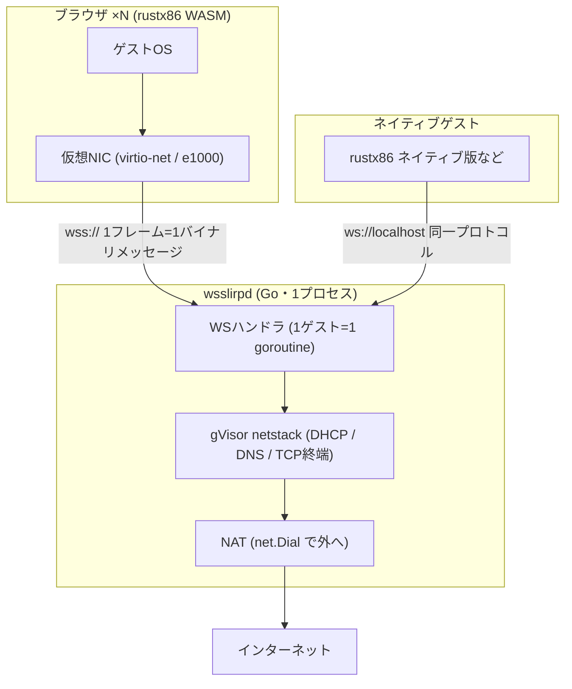

# wsslirp

Ethernetフレームを吐く非特権ゲストのためのユーザーモードNATデーモン。

ブラウザで動くエミュレータ([rustx86](https://github.com/yoshiharu-ishii/rustx86) WASM版)は生ソケットを持てない。そこでゲストOSの仮想NICが吐くEthernetフレームをWebSocketでそのまま運び、サーバー側のgVisor netstackでTCP/UDPを終端して、本物のソケットでインターネットへ出る。QEMUの `-netdev user`(内蔵slirp)を独立デーモンに切り出し、WebSocketという口を付けたもの、と考えると正確。



## プロトコル

トランスポートとの契約はこれだけ:

- **1 WebSocketバイナリメッセージ = 1 Ethernetフレーム**(最大1514バイト、L3 MTU 1500)
- エンドポイント: `GET /net?token=<共有トークン>` → WebSocketアップグレード
- TLS終端はデプロイに任せる(リバースプロキシで `wss://` にする)

コア(`pkg/slirpstack`)はWebSocketを知らない。`FrameIO`(ReadFrame/WriteFrame)にだけ依存するので、UDSやインプロセスchannelなど別トランスポートを後から足せる。

## ゲストから見えるネットワーク

slirp互換のレイアウト。ゲストごとに独立したスタックを作るので、ゲスト同士は互いに見えない。

| アドレス | 役割 |
|---|---|
| 10.0.2.0/24 | サブネット(DHCPで配布) |
| 10.0.2.2 | ゲートウェイ(ARP/ICMP echo応答あり) |
| 10.0.2.3 | DNS(上流リゾルバへ転送) |
| 10.0.2.15 | ゲストのアドレス(DHCPリース) |

- DHCP応答はnetstackに入る前のフレーム層で処理(discover→offer、request→ack)
- TCP: `tcp.NewForwarder` でゲストのTCPを終端し、`net.Dial` で張り直す。ハーフクローズは伝搬する(片方向のFINは `CloseWrite` で相手側に届き、逆方向は流れ続ける)
- UDP: フローごとに転送、60秒アイドルで回収。10.0.2.3:53宛は上流DNSへ

## セキュリティ

公開されたリレーは放っておくと踏み台(オープンプロキシ)になるため:

- `-token` : 接続時の共有トークン認証(定数時間比較)
- egressフィルタ: loopback・RFC1918・リンクローカル・マルチキャスト宛を遮断(SSRF対策)。開発時のみ `-allow-private` で解除
- ゲストのフレームは全てユーザーランドで処理され、ホストのネットワークスタックには触れない

## 使い方

```
go run ./cmd/wsslirpd -listen 127.0.0.1:8087 -token <secret>
```

| フラグ | 意味 |
|---|---|
| `-listen` | 待ち受けアドレス(デフォルト 127.0.0.1:8087) |
| `-token` | 共有トークン(`WSSLIRP_TOKEN` 環境変数でも可。空で認証なし) |
| `-allow-private` | プライベート宛egress許可(開発用) |
| `-upstream-dns` | 上流リゾルバ host:port(デフォルト: resolv.conf → 1.1.1.1:53) |

## テスト

```
go test ./...
```

合成ゲスト(gVisor netstackをクライアント側にも立てて本物のARP/TCPハンドシェイクを喋らせる)でフレーム経路をE2E検証している。実インターネットへの疎通テストは起動中のデーモンを指して:

```
WSSLIRP_E2E_URL='ws://127.0.0.1:8098/net?token=test' go test ./pkg/wsstransport -run RealInternet -v
```

## ロードマップ(台帳)

未実装。必要になった実測時点で取り出す:

- 外向きICMP echoプロキシ(現状ゲートウェイへのpingのみ応答)
- UDS / インプロセストランスポート
- ゲストごとの帯域制限・メトリクス
- IPv6
- DHCPオプションのカスタマイズ(NTP、ドメイン名など)
