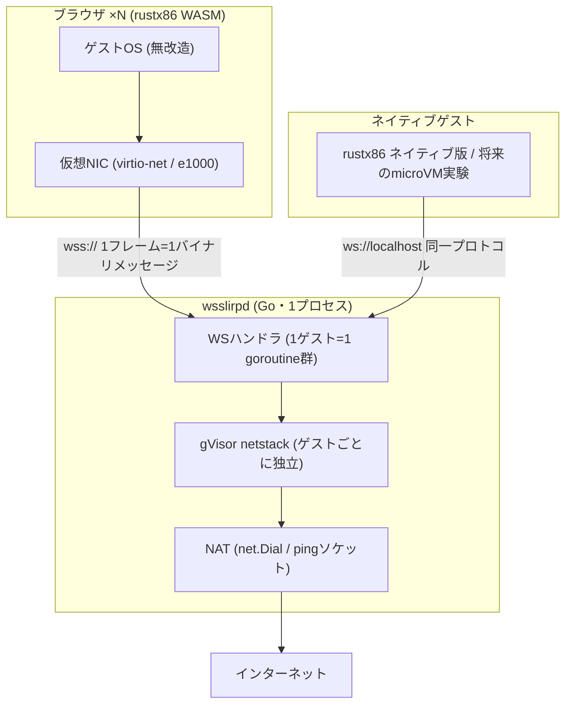
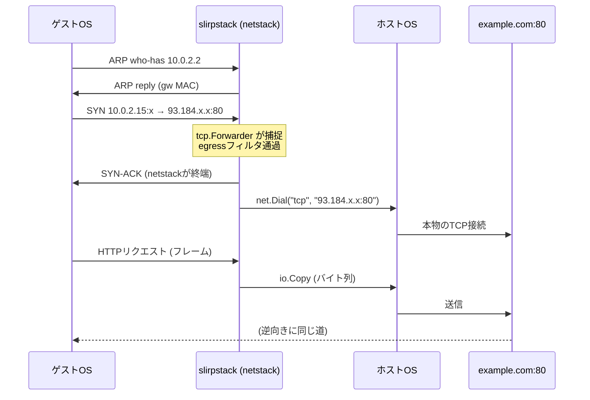
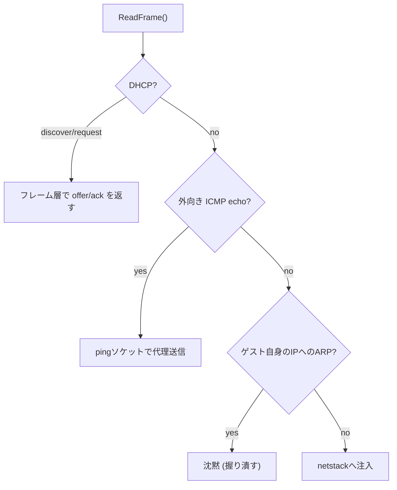

# wsslirp アーキテクチャ

wsslirpは「Ethernetフレームを吐く非特権ゲスト」のためのユーザーモードNATである。最初のクライアントはブラウザで動く [rustx86](https://github.com/yoshiharu-ishii/rustx86)(WASM)だが、設計上はrustx86専用品ではない。この文書は、なぜこの形になったかを設計判断の順に書く。

## 全体像



ブラウザには生ソケットが無い。だからゲストOSの仮想NICが吐くEthernetフレームをWebSocketでそのまま踏み台(wsslirpd)へ運び、そこでTCP/UDPを終端して本物のソケットで外へ出る。QEMUの `-netdev user`(内蔵slirp)を独立デーモンに切り出し、WebSocketという口を付けたもの、というのが一番正確な説明になる。

## なぜL2(Ethernetフレーム)で運ぶか

ゲストOSは無改造で動かす。とすると、エミュレータから出てくるものは仮想NICが吐く生のEthernetフレームしかない。つまりレイヤの選択肢は実質的に無く、「1フレームをどう運ぶか」だけが設計の自由度になる。

WebSocketを選んだ理由:

- ブラウザで使える唯一の双方向バイナリ通信である(WebTransportはまだ普及途上)
- メッセージ境界を持つ。「1バイナリメッセージ = 1フレーム」とすれば長さプレフィックスすら不要
- 下がTCPなので順序保証と再送がタダで付いてくる

TCPの上にTCPを載せる(TCP-over-TCP)ことになるが、これは問題にならない。踏み台が詰まったときはEthernetフレームを**捨てればいい**。フレームはもともと落ちるものとして設計されており、ゲスト側のTCPが勝手に再送してくれる。バッファを溜め込まずに捨てる、という選択肢があるおかげでバックプレッシャ設計が単純になる。

プロトコルの全文はこれで終わる:

- 1 WebSocketバイナリメッセージ = 1 Ethernetフレーム(最大1514バイト、L3 MTU 1500)
- エンドポイント `GET /net?token=<共有トークン>` → WebSocketアップグレード
- TLSはデプロイの仕事(リバースプロキシで `wss://` にする)

## コアとトランスポートの分離

賢さは全部踏み台側に置き、その踏み台の中でもさらに「ネットワークの胴元」と「フレームの運び方」を分ける。

```
pkg/slirpstack   コア。FrameIO(ReadFrame/WriteFrame)にだけ依存
pkg/wsstransport WebSocket ⇄ FrameIO の変換だけ
cmd/wsslirpd     デーモン本体
```

コアが要求するのはこのインターフェースだけである:

```go
type FrameIO interface {
    ReadFrame() ([]byte, error)
    WriteFrame([]byte) error  // 並行呼び出し安全であること
}
```

この境界のおかげで:

- ブラウザのrustx86は `wss://` で、ネイティブ版は `ws://localhost` で、**同じデーモンの同じプロトコル**にぶら下がれる
- テストはインメモリのチャネル(`internal/testutil.FramePipe`)で本物のフレーム経路をE2Eで回せる
- 将来UDSやインプロセス接続(Goホストからの直接import)を足すときもコアは無変更

rustx86側から見ると、OS依存・非決定的なI/O(実ソケット、DNS、NAT)は全部デーモンに寄り、エミュレータ本体は「フレームの出入り口」というtraitの後ろで決定論的な純粋計算のままでいられる。

## ゲストから見えるネットワーク

slirp互換のレイアウト。**ゲストごとに独立したnetstackを作る**ので、全ゲストが同じアドレスを持ち、互いに見えない。

| アドレス | 役割 |
|---|---|
| 10.0.2.0/24 | サブネット(DHCPで配布) |
| 10.0.2.2 | ゲートウェイ(ARP/ICMP echo応答あり) |
| 10.0.2.3 | DNS(上流リゾルバへ転送) |
| 10.0.2.15 | ゲストのアドレス(DHCPリース) |

## フレームの旅: TCP接続1本の一生

ゲストがどこかのWebサーバに繋ぐとき、フレームはこう流れる。



肝は**TCPが2本ある**こと。ゲスト⇄netstack間の「仮想TCP」と、ホスト⇄宛先間の「本物のTCP」で、踏み台は両者のバイト列を `io.Copy` で繋ぐだけである。シーケンス番号もウィンドウも輻輳制御も、それぞれの区間で独立に動く。ハーフクローズも伝搬する: ゲストが書き側を閉じればFINが `CloseWrite` として本物のソケットに届き、逆方向のデータは流れ続ける。

これを可能にしているのがgVisor netstackの2つのスイッチである:

- **Promiscuousモード** — 宛先IPが何であれ(93.184.x.xでも)パケットをトランスポート層のハンドラに配送する。捕捉には `tcp.NewForwarder` / `udp.NewForwarder` を使う
- **Spoofing** — 応答時に他人のアドレス(93.184.x.x)を送信元として名乗ることを許す

UDPも同じ構造で、フローごとに転送し60秒アイドルで回収する。10.0.2.3:53宛だけは特別扱いで上流リゾルバに転送される(ゲストにとってのDNSサーバは踏み台自身)。

## netstackに入れる前に済ませる仕事

`Run()` の受信ループは、フレームをnetstackに注入する前に3つの検査を通す。順序に意味がある。



**DHCPをフレーム層で処理する理由**: DHCP discoverは送信元0.0.0.0・宛先255.255.255.255のブロードキャストで、netstackのUDP forwarderにブロードキャストを正しく配送させるのは微妙な話になる。gopacketでパースして直接offer/ackフレームを組み立てる方が決定論的で、テストも自明になる。

**ICMPをフレーム層で処理する理由**: netstackは自分のアドレス(10.0.2.2)宛のechoには答えるが、外向きのechoを「代理でpingする」機能は無い。そこでゲートウェイ以外宛のecho requestを捕まえ、非特権pingソケット(`SOCK_DGRAM` + `IPPROTO_ICMP`)で外へ送り、応答をecho replyフレームに組み直して返す。macOSはそのまま動く。Linuxはデーモンのグループが sysctl `net.ipv4.ping_group_range` に入っている必要がある(入っていなければ外向きpingだけタイムアウトし、他は無影響)。同時実行数は64に制限し、超過分は普通のパケットロスとしてゲストに見せる。

**ARPを1種類だけ握り潰す理由**: 次節。

## ARPの挙動 — 全宛先プロキシARPと、1つの例外

spoofingを有効にしたnetstackは、ARPにも「何にでも代返する」性質を持つ。実測結果(フレームを直接撃って観測):

| ARPの宛先 | 応答 |
|---|---|
| 10.0.2.2 (gw) | `is-at 52:55:0a:00:02:02` |
| 10.0.2.3 (DNS) | 同じMAC |
| 10.0.2.99 (サブネット内・未使用) | 同じMAC |
| 8.8.8.8 (サブネット外) | 同じMAC |
| 10.0.2.15 (ゲスト自身) | **沈黙** |
| 10.0.2.15 (RFC 5227プローブ、送信元0.0.0.0) | **沈黙** |

つまり事実上の**全インターネット・プロキシARP**である。これは欠陥ではなく都合が良い。サブネットマスクを間違えたゲスト(`/8` と誤設定して8.8.8.8を同一セグメントだと思い込み、直接ARPを撃つ)でも、デフォルトルート未設定のゲストでも、フレームさえ踏み台に届けばTCPは普通に終端される。ゲストのARPテーブルは全部同じMACで埋まるが、L2としては何も困らない。

例外の「ゲスト自身のIPへの沈黙」は実戦で学んだ。mTCPは起動時に自分のIPへARPを撃ち(RFC 5227のアドレス衝突検査)、誰かが答えると「他のマシンが10.0.2.15を使っている」と判断して起動を中止する。spoofing有効のnetstackは当然これにも代返してしまうので、`isArpForGuest` ガードがnetstackに届く前に握り潰す。実LANでも、そのアドレスが本当に使われていない限り誰も答えない — 踏み台も同じように振る舞う必要がある。

**既知の穴**: このガードは `Config.GuestIP`(10.0.2.15)としか比較していない。DHCPを使わず別の静的IP(たとえば10.0.2.99)を名乗るゲストのDADには代返してしまい、同じ誤検出が再発する。塞ぐなら「スタック自身のアドレス(gw/DNS)以外のサブネット内アドレスには沈黙」に広げる(台帳入り)。

## セキュリティモデル

インターネットに公開された踏み台は、放っておくとオープンプロキシになる。防御は3層:

1. **入口** — `-token` の共有トークン認証(定数時間比較)。WSアップグレード前に弾く
2. **出口** — egressフィルタ。loopback・RFC1918・リンクローカル・マルチキャスト宛を遮断(SSRF対策)。TCP・UDP・外向きICMPすべてに適用され、TCPはRST、UDPはICMP port unreachable、ICMPは無応答としてゲストに見える。開発時のみ `-allow-private` で解除
3. **構造** — ゲストのフレームはすべてユーザーランド(netstack)で処理され、ホストのネットワークスタックには一切触れない。ゲスト同士は独立スタックで隔離されている

## フローログ(監査)

ゲストがどこへ出ていったかを1行ずつ記録する。行の形は固定で、**矢印は常に接続を開いた向き**(左がゲスト):

```
slirp: [g1] guest connected from 127.0.0.1:51531
slirp: [g1] udp open  10.0.2.15:39060 -> 10.0.2.3:53 (dns via 192.168.10.1:53)
slirp: [g1] tcp open  10.0.2.15:62640 -> 104.20.23.154:80
slirp: [g1] tcp close 10.0.2.15:62640 -> 104.20.23.154:80 (97ms, -> 56 B, <- 868 B)
slirp: [g2] icmp echo  10.0.2.15 -> 1.1.1.1 (seq=1, 16 B)
slirp: [g2] icmp reply 10.0.2.15 <- 1.1.1.1 (seq=1, 13ms)
slirp: [g2] tcp deny  10.0.2.15:53659 -> 10.99.0.1:80
```

設計判断:

- `<-` が主役になるのはICMP応答行だけ。他の行の矢印は接続方向で固定なので、`grep ' -> '` でフローを数えられる
- クローズ行のバイト数は方向つき(`-> 56 B` が送信、`<- 868 B` が受信)。カウントは転送中に加算するので、ctxキャンセルで畳まれたフローも実績値が残る
- 送信元ポートはopen行とclose行で一致する。フローの対応付けはこれで行う(テストで固定済み)
- `[gN]` はゲスト識別子。実クライアントIPと結び付くのは `guest connected from` の行だけなので、フロー行だけを外部に渡しても接続元は漏れない
- `deny` / `fail` / `drop` はフローログを切っていても常に出る。トラフィックではなくセキュリティ事象だから
- ライブラリ(`Config.LogFlows`)のデフォルトは無効。フロー行はゲストのアクセス先の完全な記録なので、組み込み側の明示的なオプトインを要求する。デーモンは監査目的なので既定で有効(`-log-flows=false` で停止)

## 検証の方法

ユニットテストの主役は**合成ゲスト**である。gVisor netstackをクライアント側にも立て(`internal/testutil.Guest`)、インメモリのフレームパイプ越しに本物のARP→DHCP→TCPハンドシェイクを喋らせる。モックではなく、実ゲストOSと同じフレーム列が流れる。

実インターネットへの疎通は環境変数ゲート付きテストで行う:

```
WSSLIRP_E2E_URL='ws://127.0.0.1:8098/net?token=test' go test ./pkg/wsstransport -run RealInternet -v
```

DNS解決(ゲスト→10.0.2.3→上流)、HTTP GET(example.comから200 OK)、外向きping(1.1.1.1からのecho reply)までを、起動中の実デーモン相手に通す。

## 台帳(未実装)

必要になった実測時点で取り出す:

- ARPガードの一般化(静的IPゲストのDAD誤検出。上記「既知の穴」)
- UDS / インプロセストランスポート
- ゲストごとの帯域制限・メトリクス
- IPv6
- DHCPオプションのカスタマイズ(NTP、ドメイン名など)
